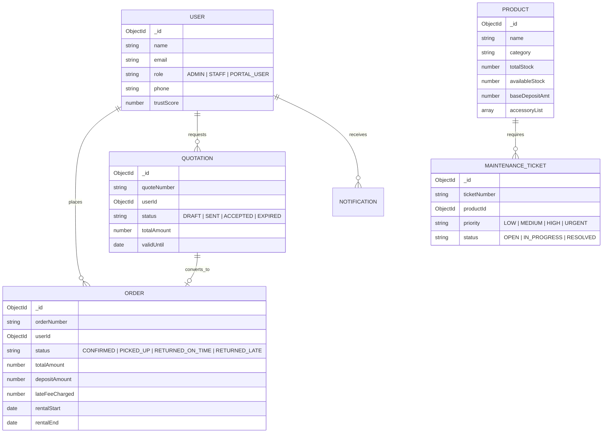

# 🏢 Lease360 — Enterprise Equipment Rental & Lease Security Engine

[](https://nextjs.org/)
[](https://www.mongodb.com/)
[](https://tailwindcss.com/)
[](https://developer.mozilla.org/en-US/docs/Web/Progressive_web_apps)
[](https://opensource.org/licenses/MIT)

**Lease360** is a full-stack, enterprise-grade equipment rental & lease management system built for the **Odoo Hackathon 2026**. It solves critical industry bottlenecks around security deposit holds, automated late-fee calculation, equipment condition scoring, maintenance stock isolation, live dispatch route tracking, and AI-driven operational analytics.

---

## 📌 Table of Contents

1. [Executive Summary](#-executive-summary)
2. [Key System Features](#-key-system-features)
3. [Architecture & Technology Stack](#-architecture--technology-stack)
4. [Database Models & ER Diagram](#-database-models--er-diagram)
5. [API Reference & Route Specifications](#-api-reference--route-specifications)
6. [LeaseMind AI Engine](#-leasemind-ai-engine)
7. [Email Notification System](#-email-notification-system)
8. [PWA & Mobile Capabilities](#-pwa--mobile-capabilities)
9. [Getting Started & Local Setup](#-getting-started--local-setup)
10. [Demo Logins & Test Credentials](#-demo-logins--test-credentials)

---

## 🚀 Executive Summary

Managing high-value rental equipment (cameras, gimbals, lighting, industrial tools) requires strict control over asset availability, security deposits, damage assessments, and timely returns. Traditional rental software often suffers from disconnected deposit accounting and manual inspection tracking.

**Lease360** unifies the complete 360° rental lifecycle into a single liquid-glass interface:
- **Financial Security**: Automated deposit holds (`HELD`, `PARTIALLY_REFUNDED`, `FULLY_REFUNDED`, `FORFEITED`) with multi-transaction ledgers.
- **Automated Late Fees**: Hourly rate penalization engine with configurable grace periods.
- **Condition Isolation**: Damage logging on equipment returns that automatically isolates faulty stock into maintenance workflows.
- **Real-Time Live Transit Tracker**: Dispatch route checkpoints, courier contact triggers, and counter pickup QR passes.
- **AI Operational Intelligence**: Natural language querying over live MongoDB state using Groq Llama 3 70B & Gemini 1.5 Pro.

---

## ✨ Key System Features

### 1. 🛡 Security Deposit Ledger & Reconciliation
- Holds deposit funds automatically upon order confirmation.
- Transparently records damage deductions, late fee charges, and partial/full refunds in an immutable transaction history.

### 2. ⚡ Automated Late-Fee Engine
- Calculates late fees dynamically based on return due dates.
- Enforces configurable grace periods (e.g. 30 minutes) before applying hourly penalty rates.

### 3. 📄 Quotation Proposal & Conversion System
- Enables staff to draft custom equipment quotations with valid-until deadlines.
- 1-click customer acceptance converts quotations into active orders while re-checking and locking inventory stock.

### 4. 🚚 Live Transit Dispatch Tracker
- 4-stage logistics pipeline: **Order Confirmed** → **Dispatched / In Transit** → **At Destination** → **Return & Settled**.
- Express courier contact integration (`SHIPPING`) and store counter check-in QR pass (`STORE_PICKUP`).

### 5. 🔧 Maintenance Isolation & Condition Scoring
- Return process evaluates equipment condition (`EXCELLENT`, `GOOD`, `DAMAGED`, `MAJOR_DAMAGE`).
- Automatic creation of maintenance tickets and immediate isolation of damaged items from available inventory.

### 6. 🤖 LeaseMind AI Assistant
- Conversational AI capable of executing database queries to answer operational questions like *"What orders are overdue?"* or *"Show revenue for camera gear"*.

### 7. 📬 Multi-Role Email Notification System
- Nodemailer + Gmail SMTP integration for beautifully formatted HTML emails sent to customers, staff, and admins on order confirmation, pickup dispatch, deposit settlement, and urgent maintenance alerts.

---

## 🏗 Architecture & Technology Stack

```
 ┌─────────────────────────────────────────────────────────────┐
 │                      Lease360 Client                        │
 │        (Next.js 14 App Router + Tailwind CSS + PWA)         │
 └──────────────────────────────┬──────────────────────────────┘
                                │
                    REST API (JSON / Cookies)
                                │
 ┌──────────────────────────────▼──────────────────────────────┐
 │                     Next.js Route Handlers                  │
 │          (/api/auth, /api/orders, /api/quotations)          │
 └──────┬───────────────────────┬──────────────────────┬───────┘
        │                       │                      │
 ┌──────▼────────┐      ┌───────▼────────┐     ┌───────▼───────┐
 │ MongoDB Atlas │      │  LeaseMind AI  │     │ Nodemailer    │
 │ (Mongoose ORM)│      │  (Groq/Gemini) │     │ (Gmail SMTP)  │
 └───────────────┘      └────────────────┘     └───────────────┘
```

- **Frontend**: Next.js 14 App Router, React 18, Tailwind CSS, Lucide Icons, Sonner Toasts.
- **Backend**: Next.js Server Route Handlers, JWT Cookie Authentication, Mongoose ORM.
- **Database**: MongoDB Atlas Cluster.
- **AI Intelligence**: Groq API (`llama-3.3-70b-versatile`) with Google Gemini 1.5 Pro fallback.
- **Transactional Mail**: Nodemailer with Gmail SMTP transporter.

---

## 📊 Database Models & ER Diagram



---

## 🔌 API Reference & Route Specifications

| Endpoint | Method | Description | Access |
|---|---|---|---|
| `/api/auth/register` | `POST` | Create new user account | Public |
| `/api/auth/login` | `POST` | Authenticate user & issue JWT cookie | Public |
| `/api/auth/me` | `GET` | Get current logged-in user profile | Authenticated |
| `/api/orders` | `GET`, `POST` | List orders or create new rental order | Authenticated |
| `/api/orders/[id]` | `GET`, `PATCH` | Fetch order details or update status | Owner / Staff |
| `/api/orders/[id]/pickup` | `POST` | Mark equipment picked up & start transit | Staff / Admin |
| `/api/orders/[id]/return` | `POST` | Process return inspection & reconcile deposit | Staff / Admin |
| `/api/quotations` | `GET`, `POST` | List or create rental proposals | Authenticated |
| `/api/quotations/[id]/convert` | `POST` | Convert quotation into confirmed order | Owner / Staff |
| `/api/products` | `GET`, `POST` | Catalog search and product management | Public / Admin |
| `/api/maintenance` | `GET`, `POST` | List maintenance tickets or report repair issue | Staff / Admin |
| `/api/notifications` | `GET`, `PATCH` | Fetch user alerts & mark as read | Authenticated |
| `/api/ai/query` | `POST` | Query LeaseMind AI co-pilot | Authenticated |

---

## 🤖 LeaseMind AI Engine

LeaseMind AI allows team members to ask operational questions in plain English:

- *"Show me all orders currently overdue"*
- *"What is our total active deposit hold balance?"*
- *"List equipment currently isolated in maintenance"*

The route handler (`/api/ai/query`) reads live collections from MongoDB, constructs structured context, and queries the **Groq Llama 3 70B** model (falling back to **Google Gemini** if rate limited), providing instant data analysis.

---

## ✉️ Email Notification System

Integrated via `src/lib/mailer.ts` using Nodemailer and HTML email templates:
- **Order Confirmation Email**: Delivered upon booking confirmation with itemized summary & deposit breakdown.
- **Pickup & Dispatch Alert**: Sent when admin marks order as picked up, emphasizing return due date.
- **Deposit Settlement Receipt**: Sent after return inspection detailing deposit hold, late fee deductions, and net refund credited.
- **Urgent Maintenance Alert**: Fired to admins when high-priority repair tickets are logged.

---

## 📱 PWA & Mobile Capabilities

Lease360 is built touch-first with PWA features:
- **Installable**: Full Web App Manifest (`public/manifest.json`) supporting standalone display on iOS, Android, and Desktop.
- **Mobile Bottom Bar**: Native tab bar for rapid navigation on mobile viewports.
- **Responsive Layouts**: Touch-friendly card stacks for mobile devices.

Read the complete guide in [`PWA_GUIDE.md`](./PWA_GUIDE.md).

---

## 🛠 Getting Started & Local Setup

### Prerequisites
- **Node.js**: v18.x or v20.x
- **npm** or **pnpm**
- **MongoDB Atlas** database connection string

### 1. Clone & Install Dependencies
```bash
git clone https://github.com/senapati484/RMS.git
cd RMS
npm install
```

### 2. Configure Environment Variables (`.env.local`)
Create a `.env.local` file in the root directory:
```env
MONGODB_URI=mongodb+srv://<username>:<password>@cluster.mongodb.net/rms
JWT_SECRET=lease360_super_secret_jwt_key_2026

# Email Dispatcher Credentials (Gmail App Password)
SMTP_EMAIL=your-email@gmail.com
SMTP_PASS=your-gmail-app-password

# AI Co-Pilot API Keys
GROQ_API_KEY=gsk_your_groq_api_key
GEMINI_API_KEY=AIzaSy_your_gemini_key
```

### 3. Seed Database
Run the automated database seeder to populate sample products and demo user accounts:
```bash
npx tsx scripts/seed.ts
```

### 4. Run Development Server
```bash
npm run dev
```
Open [http://localhost:3000](http://localhost:3000) in your browser.

---

## 🔑 Demo Logins & Test Credentials

Use these seeded accounts to test different roles and permissions:

| Role | Email | Password | Scope & Description |
|---|---|---|---|
| **Admin** | `admin@lease360.ai` | `admin123` | Full system control, revenue analytics, return inspection & maintenance |
| **Staff** | `staff@lease360.ai` | `staff123` | Pickup dispatch, return processing & maintenance tickets |
| **Customer** | `user@lease360.ai` | `user123` | Catalog browsing, rental order creation & deposit tracking |

---

## 📜 License

This project is licensed under the [MIT License](LICENSE). Built for the **Odoo Hackathon 2026**.
