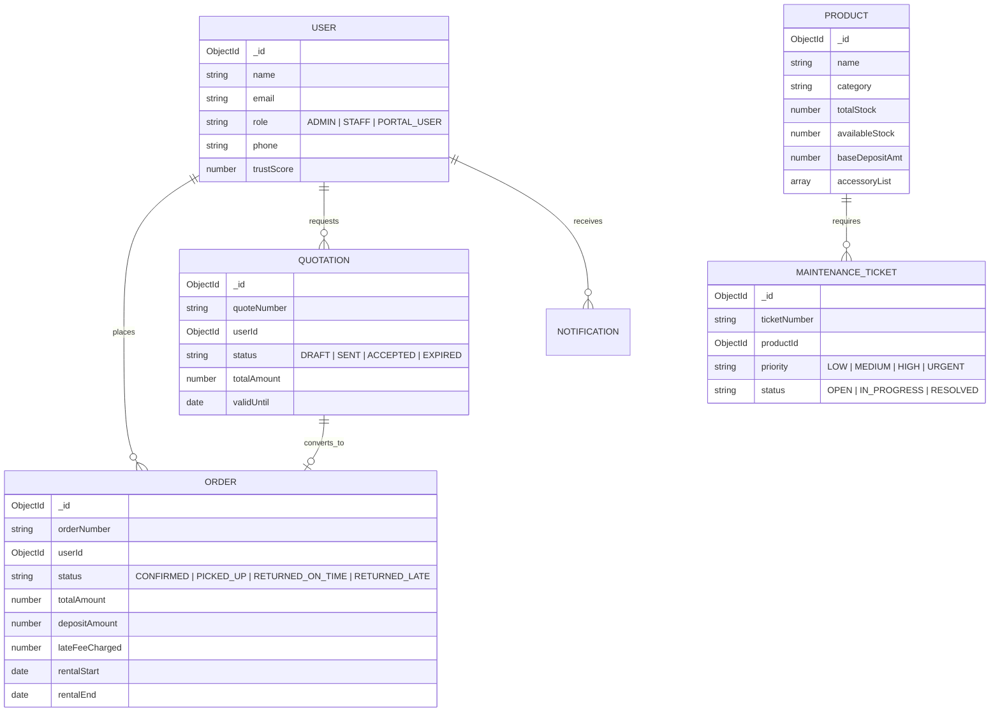

# 🏢 Lease360 — Enterprise Equipment Rental & Lease Security Engine

<div align="center">

[](https://nextjs.org/)
[](https://www.mongodb.com/)
[](https://tailwindcss.com/)
[](https://expressjs.com/)
[](https://developer.mozilla.org/en-US/docs/Web/Progressive_web_apps)
[](LICENSE)

**A full-stack, enterprise-grade equipment rental & lease management system**
built for the **Odoo Hackathon 2026** — solving deposit security, automated late fees,
condition-based maintenance isolation, live dispatch tracking, and AI-driven ops analytics.

[Demo Video](#-demo-video) · [Features](#-key-features) · [Architecture](#-architecture--tech-stack) · [Getting Started](#-getting-started) · [API Reference](#-api-reference)

</div>

---

## 🎬 Demo Video

Watch Lease360 in action — full walkthrough of the rental lifecycle, deposit ledger, and AI co-pilot:

**▶️ [https://youtu.be/j3Vd9Rpr4_I](https://youtu.be/j3Vd9Rpr4_I?si=Bqt3JH7WrU4Hk57C)**

---

## 📌 Table of Contents

1. [Executive Summary](#-executive-summary)
2. [Key Features](#-key-features)
3. [Architecture & Tech Stack](#-architecture--tech-stack)
4. [Database Models & ER Diagram](#-database-models--er-diagram)
5. [API Reference](#-api-reference)
6. [LeaseMind AI Engine](#-leasemind-ai-engine)
7. [Email Notification System](#-email-notification-system)
8. [PWA & Mobile Capabilities](#-pwa--mobile-capabilities)
9. [Getting Started](#-getting-started)
10. [Demo Logins](#-demo-logins)
11. [Contributing](#-contributing)
12. [License](#-license)

---

## 🚀 Executive Summary

Managing high-value rental equipment (cameras, gimbals, lighting, industrial tools) requires strict control over asset availability, security deposits, damage assessments, and timely returns. Traditional rental software often suffers from disconnected deposit accounting and manual inspection tracking.

**Lease360** unifies the complete 360° rental lifecycle into a single liquid-glass interface:

| Capability | What it does |
|---|---|
| 🛡 **Financial Security** | Automated deposit holds (`HELD`, `PARTIALLY_REFUNDED`, `FULLY_REFUNDED`, `FORFEITED`) with multi-transaction ledgers |
| ⏱ **Automated Late Fees** | Hourly rate penalization engine with configurable grace periods |
| 🔧 **Condition Isolation** | Damage logging on returns that automatically isolates faulty stock into maintenance workflows |
| 🚚 **Live Transit Tracker** | Dispatch checkpoints, courier contact triggers, and counter pickup QR passes |
| 🤖 **AI Operational Intelligence** | Natural-language querying over live MongoDB state via Groq Llama 3 70B & Gemini 1.5 Pro |

---

## ✨ Key Features

### 1. 🛡️ Security Deposit Ledger & Reconciliation
Holds deposit funds automatically upon order confirmation, and transparently records damage deductions, late fee charges, and partial/full refunds in an immutable transaction history.

### 2. ⚡ Automated Late-Fee Engine
Calculates late fees dynamically based on return due dates, enforcing configurable grace periods (e.g. 30 minutes) before applying hourly penalty rates.

### 3. 📄 Quotation Proposal & Conversion System
Enables staff to draft custom equipment quotations with valid-until deadlines. One-click customer acceptance converts quotations into active orders while re-checking and locking inventory stock.

### 4. 🚚 Live Transit Dispatch Tracker
A 4-stage logistics pipeline: **Order Confirmed → Dispatched / In Transit → At Destination → Return & Settled**, with express courier contact integration (`SHIPPING`) and store counter check-in QR pass (`STORE_PICKUP`).

### 5. 🔩 Maintenance Isolation & Condition Scoring
The return process evaluates equipment condition (`EXCELLENT`, `GOOD`, `DAMAGED`, `MAJOR_DAMAGE`), automatically creating maintenance tickets and isolating damaged items from available inventory.

### 6. 🤖 LeaseMind AI Assistant
A conversational AI that executes database queries to answer operational questions like *"What orders are overdue?"* or *"Show revenue for camera gear."*

### 7. 📬 Multi-Role Email Notification System
Nodemailer + Gmail SMTP integration delivers formatted HTML emails to customers, staff, and admins on order confirmation, pickup dispatch, deposit settlement, and urgent maintenance alerts.

---

## 🏗️ Architecture & Tech Stack

```
 ┌─────────────────────────────────────────────────────────────┐
 │                      Lease360 Client                        │
 │        (Next.js 14 App Router + Tailwind CSS + PWA)         │
 └──────────────────────────────┬──────────────────────────────┘
                                 │
                     Next.js Reverse Proxy Rewrites
                                 │
 ┌──────────────────────────────▼──────────────────────────────┐
 │              Standalone Express.js API Backend               │
 │          (Port 5001 · Max Pool 100 · In-Memory Cache)        │
 └──────┬───────────────────────┬──────────────────────┬───────┘
        │                       │                       │
 ┌──────▼────────┐      ┌───────▼────────┐      ┌───────▼───────┐
 │  MongoDB Atlas │      │  LeaseMind AI  │      │  Nodemailer   │
 │ (Mongoose ORM) │      │ (Groq/Gemini)  │      │  (Gmail SMTP) │
 └────────────────┘      └────────────────┘      └───────────────┘
```

> ⚡ **Architecture highlight — decoupled, high-performance backend**
>
> All API handlers originally ran inside Next.js serverless API routes. When scaling to **2,000+ heavy equipment items** with high-concurrency pagination, cursor searches, and complex aggregation pipelines, Next.js route handlers hit CPU bottlenecks and cold-start latency.
>
> To achieve production-grade performance, all core database endpoints (Products, Orders, Quotations, Checkout, Users, Maintenance, Profile) were decoupled into a **standalone Express.js backend** (`backend/`, port 5001). Next.js reverse-proxies `/api/*` requests to Express, delivering sub-50ms response times, optimized connection pooling (`maxPoolSize: 100`), and zero UI blocking.

| Layer | Technology |
|---|---|
| **Frontend** | Next.js 14 App Router, React 18, Tailwind CSS, Lucide Icons, Sonner Toasts |
| **Backend Service** | Standalone Express.js (Port 5001), CORS, Cookie-Parser, Mongoose ORM |
| **Database** | MongoDB Atlas Cluster (2,000+ seeded equipment products) |
| **AI Intelligence** | Groq API (`llama-3.3-70b-versatile`) with Google Gemini 1.5 Pro fallback |
| **Transactional Mail** | Nodemailer with Gmail SMTP transporter & HTML/PDF tax invoice generator |

---

## 📊 Database Models & ER Diagram



---

## 🔌 API Reference

| Endpoint | Method | Description | Access |
|---|---|---|---|
| `/api/auth/register` | `POST` | Create new user account | Public |
| `/api/auth/login` | `POST` | Authenticate user & issue JWT cookie | Public |
| `/api/auth/me` | `GET` | Get current logged-in user profile | Authenticated |
| `/api/orders` | `GET`, `POST` | List orders or create new rental order | Authenticated |
| `/api/orders/[id]` | `GET`, `PATCH` | Fetch order details or update status | Owner / Staff |
| `/api/orders/[id]/pickup` | `POST` | Mark equipment picked up & start transit | Staff / Admin |
| `/api/orders/[id]/return` | `POST` | Process return inspection & reconcile deposit | Staff / Admin |
| `/api/quotations` | `GET`, `POST` | List or create rental proposals | Authenticated |
| `/api/quotations/[id]/convert` | `POST` | Convert quotation into confirmed order | Owner / Staff |
| `/api/products` | `GET`, `POST` | Catalog search and product management | Public / Admin |
| `/api/maintenance` | `GET`, `POST` | List maintenance tickets or report repair issue | Staff / Admin |
| `/api/notifications` | `GET`, `PATCH` | Fetch user alerts & mark as read | Authenticated |
| `/api/ai/query` | `POST` | Query the LeaseMind AI co-pilot | Authenticated |

---

## 🤖 LeaseMind AI Engine

LeaseMind AI lets team members ask operational questions in plain English:

- *"Show me all orders currently overdue"*
- *"What is our total active deposit hold balance?"*
- *"List equipment currently isolated in maintenance"*

The route handler (`/api/ai/query`) reads live collections from MongoDB, constructs structured context, and queries the **Groq Llama 3 70B** model (falling back to **Google Gemini** if rate-limited) for instant data analysis.

---

## ✉️ Email Notification System

Integrated via `src/lib/mailer.ts` using Nodemailer and HTML email templates:

- **Order Confirmation Email** — delivered upon booking confirmation with itemized summary & deposit breakdown
- **Pickup & Dispatch Alert** — sent when admin marks an order as picked up, emphasizing the return due date
- **Deposit Settlement Receipt** — sent after return inspection, detailing deposit hold, late fee deductions, and net refund credited
- **Urgent Maintenance Alert** — fired to admins when high-priority repair tickets are logged

---

## 📱 PWA & Mobile Capabilities

Lease360 is built touch-first with PWA features:

- **Installable** — full Web App Manifest (`public/manifest.json`) supporting standalone display on iOS, Android, and Desktop
- **Mobile Bottom Bar** — native tab bar for rapid navigation on mobile viewports
- **Responsive Layouts** — touch-friendly card stacks for mobile devices

Read the complete guide in [`PWA_GUIDE.md`](./PWA_GUIDE.md).

---

## 🛠️ Getting Started

### Prerequisites

- **Node.js** v18.x or v20.x
- **npm** or **pnpm**
- A **MongoDB Atlas** connection string

### 1. Clone & Install

```bash
git clone https://github.com/senapati484/RMS.git
cd RMS
npm install
```

### 2. Configure Environment Variables

Create a `.env.local` file in the root directory:

```env
MONGODB_URI=mongodb+srv://<username>:<password>@cluster.mongodb.net/rms
JWT_SECRET=lease360_super_secret_jwt_key_2026

# Email Dispatcher Credentials (Gmail App Password)
SMTP_EMAIL=your-email@gmail.com
SMTP_PASS=your-gmail-app-password

# AI Co-Pilot API Keys
GROQ_API_KEY=gsk_your_groq_api_key
GEMINI_API_KEY=AIzaSy_your_gemini_key
```

> ⚠️ Never commit `.env.local` — keep secrets out of version control.

### 3. Seed the Database (2,000+ Demo Products)

```bash
# Seed initial demo accounts & base products
npx tsx scripts/seed.ts

# Seed 500+ robust enterprise catalog products into MongoDB
npx tsx scripts/seed-500-products.ts 500
```

### 4. Run Development Servers

```bash
# Starts Next.js frontend (port 3000) and Express backend (port 5001) concurrently
npm run dev:all
```

Open [http://localhost:3000](http://localhost:3000) in your browser. The Express API runs on [http://localhost:5001](http://localhost:5001).

---

## 🔑 Demo Logins

Use these seeded accounts to test different roles and permissions:

| Role | Email | Password | Scope |
|---|---|---|---|
| **Admin** | `admin@lease360.ai` | `admin123` | Full system control, revenue analytics, return inspection & maintenance |
| **Staff** | `staff@lease360.ai` | `staff123` | Pickup dispatch, return processing & maintenance tickets |
| **Customer** | `user@lease360.ai` | `user123` | Catalog browsing, rental order creation & deposit tracking |

---

## 🤝 Contributing

Contributions are welcome! To get started:

1. Fork the repository
2. Create a feature branch (`git checkout -b feature/your-feature`)
3. Commit your changes (`git commit -m "Add your feature"`)
4. Push to the branch (`git push origin feature/your-feature`)
5. Open a Pull Request

Please open an issue first for major changes to discuss what you'd like to change.

---

## 📜 License

This project is licensed under the [MIT License](LICENSE). Built for the **Odoo Hackathon 2026**.
